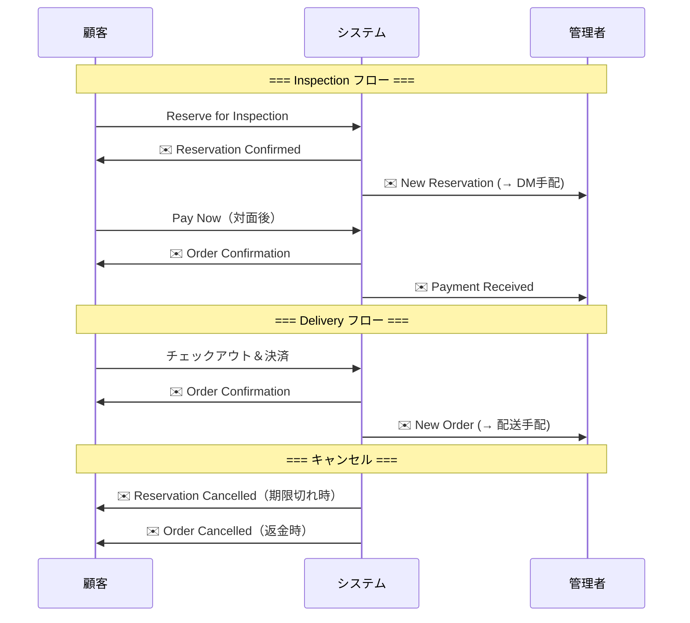
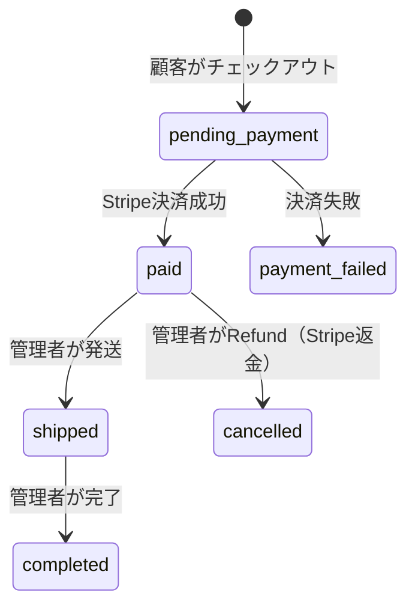
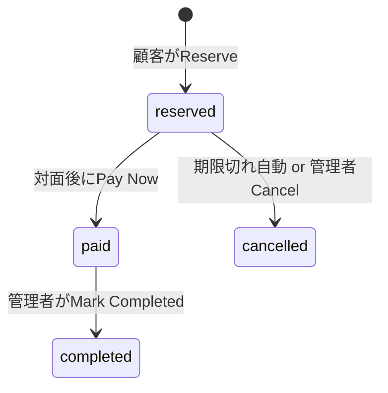

# AnimeHubs 運用ガイド

## 1. メール通知マトリックス

| タイミング | 購入者に届くメール | 管理者に届くメール |
|-----------|-------------------|-------------------|
| 予約時（Inspection） | Reservation Confirmed（View Order リンク付き） | [AnimeHubs] New Reservation: AH-XXXX → **Action: Instagram DM で対面手配** |
| 決済完了（Inspection Pay Now） | Order Confirmation | [AnimeHubs] Payment Received (Inspection): AH-XXXX → **Action: 対面で手渡し、配送不要** |
| 決済完了（Delivery） | Order Confirmation | [AnimeHubs] New Order (Delivery): AH-XXXX → **Action: 配送が必要** |
| 予約キャンセル（期限切れ / 管理者操作） | Reservation Cancelled | — |
| 有料注文キャンセル（返金時） | Order Cancelled（返金情報付き） | — |

### メール送信タイミング図



---

## 2. 注文ステータス遷移図

### Delivery フロー



### Inspection フロー



---

## 3. 購入フロー（顧客視点）

### Delivery

1. カートに追加 → チェックアウト → 住所入力 → Stripe 決済 → 完了メール → 配送待ち

### Inspection

1. カートに追加 → チェックアウト → 「Reserve for Inspection」 → 注文詳細ページ
2. Instagram DM で対面日程を調整
3. 対面で商品確認 → 満足なら「Pay Now」→ Stripe 決済 → その場で手渡し
4. 不満なら → 管理者がキャンセル → 在庫が戻る

---

## 4. 管理画面の操作ガイド（/admin/orders）

| ステータス | 表示されるボタン | 押した時の影響 |
|-----------|----------------|---------------|
| reserved | Cancel Reservation | ステータス → cancelled、在庫仮押さえ解除、顧客にキャンセルメール |
| paid (delivery) | Mark Completed / Refund | 完了処理 or Stripe 返金 → cancelled |
| paid (inspection) | Mark Completed | 完了処理（返金ボタンなし。対面販売のため返金義務なし） |

---

## 5. 予約キャンセル（手動）

- **現在は手動運用**: 管理画面（/admin/orders）から「Cancel Reservation」で個別キャンセル
- 7日以内に対面できなかった予約は、管理者が手動でキャンセルする
- キャンセルすると: reserved_stock 解放、顧客にキャンセルメール送信
- Stripe 返金なし（予約時点では決済していないため不要）

### 将来の自動化（Cron）

自動キャンセルを導入する場合:
1. Cloudflare環境変数に `CRON_SECRET` を追加（`openssl rand -base64 32` で生成）
2. [cron-job.org](https://cron-job.org)（無料）でジョブ作成:
   - URL: `https://ドメイン/api/cron/cancel-expired-inspections`
   - Method: POST
   - Schedule: 毎時（`0 * * * *`）
   - Header: `Authorization: Bearer {CRON_SECRETの値}`
3. これで予約から7日超過した注文が自動キャンセルされる

---

## 6. 在庫管理ロジック

| アクション | stock | reserved_stock |
|-----------|-------|---------------|
| 予約（Reserve） | 変化なし | +N |
| 決済完了（Pay Now / Delivery） | -N | -N |
| 予約キャンセル（期限切れ / 管理者） | 変化なし | -N |
| 有料注文返金（Delivery） | +N | 変化なし |

> **実質在庫 = stock - reserved_stock**
> カート画面や商品ページではこの値が「購入可能数」として表示される。

---

## 7. 制限・ルール

| ルール | 値 | 備考 |
|--------|-----|------|
| 最大予約数 | 3 件/ユーザー | 超過時はエラー表示 |
| 予約有効期限 | 7 日 | 超過で自動キャンセル |
| Inspection paid 後の返金 | なし | 対面販売 = スウェーデン距離販売法の対象外 |
| Stripe Checkout Session | 30 分で期限切れ | 期限切れ後も再度 Pay Now 可能 |

---

## 8. デプロイ手順

### 通常のコード修正リリース

1. ローカルで修正・動作確認（`npm run dev:cf`）
2. `git add` → `git commit` → `git push origin main`
3. Cloudflare が自動でビルド・デプロイ（数分で完了）

※ 設定変更（wrangler.toml 等）を含む場合は `npm run build:cf` でローカルビルド確認してからpush

### 環境変数の追加・変更

Cloudflare Dashboard の環境変数は Workers に届かないことがある。**必ず `wrangler secret` で設定する**：

```bash
npx wrangler secret put 変数名
# プロンプトで値を入力
```

設定済みの確認:
```bash
npx wrangler secret list
```

### 現在の本番環境変数一覧

| 変数名 | 用途 | 備考 |
|--------|------|------|
| AUTH_SECRET | NextAuth署名キー | |
| AUTH_TRUST_HOST | NextAuth ホスト信頼 | `true` |
| AUTH_URL | NextAuth ベースURL | `https://anime-hubs.com` |
| AUTH_GOOGLE_ID | Google OAuth ID | |
| AUTH_GOOGLE_SECRET | Google OAuth Secret | |
| STRIPE_SECRET_KEY | Stripe本番キー | `sk_live_...` |
| STRIPE_PUBLISHABLE_KEY | Stripe公開キー | `pk_live_...` |
| STRIPE_WEBHOOK_SECRET | Stripe Webhook署名 | `whsec_...` |
| RESEND_API_KEY | メール送信 | |
| RESEND_FROM_EMAIL | 送信元メール | `AnimeHubs <noreply@anime-hubs.com>` |
| JWT_SECRET | 管理者JWT | |
| ADMIN_PASSWORD_HASH | 管理者パスワード | |
| INSTAGRAM_URL | Instagram リンク | |
| NEXT_PUBLIC_SITE_URL | サイトURL | |

---

## 9. 本番DB操作

wrangler 経由で本番D1に直接SQLを実行できる。

### よく使うコマンド

```bash
# テーブル一覧
npx wrangler d1 execute animehubs-db --remote --command "SELECT name FROM sqlite_master WHERE type='table'"

# 商品一覧
npx wrangler d1 execute animehubs-db --remote --command "SELECT id, name_en, stock, reserved_stock FROM products"

# 注文一覧
npx wrangler d1 execute animehubs-db --remote --command "SELECT id, order_number, status, type FROM orders"

# ユーザー一覧
npx wrangler d1 execute animehubs-db --remote --command "SELECT id, email, role FROM users"
```

### テストデータのクリーンアップ

本番でテスト後、データを削除する場合（注文 → 商品の順で削除）：

```bash
# 注文を全削除
npx wrangler d1 execute animehubs-db --remote --command "DELETE FROM orders"

# 商品を全削除
npx wrangler d1 execute animehubs-db --remote --command "DELETE FROM products"

# reserved_stock リセット（商品を残す場合）
npx wrangler d1 execute animehubs-db --remote --command "UPDATE products SET reserved_stock = 0"
```

### DBマイグレーション

スキーマ変更があった場合：

```bash
npx wrangler d1 migrations apply animehubs-db --remote
```

### リアルタイムログ

本番のエラー調査：

```bash
npx wrangler tail animehubs
```

---

## 10. Stripe 本番の注意

- **本番Stripeでのテスト決済は実際に課金される**
- テスト時は少額商品（1 SEK等）で確認するか、Inspection（予約のみ）で確認
- Stripe Dashboard の本番モードで Webhook ログ・決済履歴を確認可能
